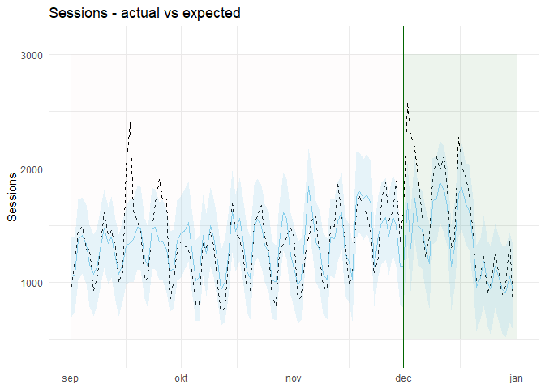

6. Del 2 - Estimera effekten av en marknadsföringskampanj med Causal Impact
===========================================================================

Den första December 2019 startade företaget en marknadsföringskampanj
med syftet att sälja mer produkter inför Jul. Tanken var att öka
exponeringen både på sociala medier samt att få mer betald trafik genom
Google’s annonser (*Pay-Per-Click*) med slutmålet att öka försäljningen.

Din uppgift är att estimera effekten av marknadsföringskampanjen som
startade den 1 December 2019 och varade månaden ut. Mer specifikt är din
uppgift är att estimera hur många extra sessioner som kampanjen
genererade under december månad från början till slut.

Till hjälp har vi R-paketet *Causal Impact*. Skumma gärna igenom
följande artikel innan du börjar:
<a href="https://google.github.io/CausalImpact/CausalImpact.html" class="uri">https://google.github.io/CausalImpact/CausalImpact.html</a>

Det data vi har till förfogande importeras först genom koden nedan.

    if(!"pacman" %in% installed.packages()[,"Package"]) install.packages("pacman")

    pacman::p_load(tidyverse,
                   lubridate,
                   CausalImpact,
                   scales)

    read_csv("traffic_long.csv") -> traffic_long

    traffic_long %>% glimpse()

    ## Observations: 2,896
    ## Variables: 11
    ## $ default_channel_grouping  <chr> "Paid Search", "Paid Search", "Paid Se…
    ## $ date                      <date> 2019-09-17, 2019-08-20, 2019-09-16, 2…
    ## $ users                     <dbl> 2221, 1971, 1862, 1828, 1814, 1783, 17…
    ## $ new_users                 <dbl> 1938, 1737, 1576, 1463, 1527, 1429, 13…
    ## $ sessions                  <dbl> 2404, 2089, 1997, 2581, 1889, 1947, 19…
    ## $ bounce_rate               <dbl> 0.5836106, 0.6108186, 0.5818728, 0.547…
    ## $ pages_per_session         <dbl> 3.478369, 3.037817, 3.026540, 3.468829…
    ## $ avg__session_duration     <dbl> 125.72546, 98.64146, 109.88232, 142.53…
    ## $ ecommerce_conversion_rate <dbl> 0.0012479201, 0.0004786979, 0.00100150…
    ## $ transactions              <dbl> 3, 1, 2, 3, 3, 3, 5, 2, 4, 2, 0, 5, 4,…
    ## $ revenue                   <dbl> 87.00, 29.00, 73.70, 73.80, 139.00, 18…

Då vi vill veta hur många sessioner från betald trafik som har
tillkommit är sessioner från *Paid Search* vår **event-variabel**.
Modellen kräver att vi också anger en **kontrollvariabel** som ska ha
varit opåverkad av kampanjen. Eftersom direkt trafik (*direct*) bör vara
opåverkad använder vi den som kontroll.

Sedan behöver vi filtrera och transformera vår data. Vi plockar först ut
sessioner från de relevanta källorna med koden nedan.

    traffic_long %>%
      dplyr::select(default_channel_grouping, date, sessions) %>% 
      filter(default_channel_grouping %in% c("Paid Search", "Direct")) -> traffic_data

    traffic_data %>% 
      ggplot(aes(x = date, y = sessions,
                 color = default_channel_grouping)) +
      geom_line() +
      geom_vline(xintercept = as.Date("2019-12-01")) +
      labs(
        color = "",
        x = "",
        y = "Sessions",
        title = "Sessions by traffic source"
      ) +
      scale_color_manual(values = c("skyblue", "dark red")) +
      facet_grid(rows = vars(default_channel_grouping), scales = "free") +
      theme_minimal() +
      theme(legend.position = "top",
            panel.spacing = unit(2, "lines"))

Därefter måste vi transformera datat så att det kan hanteras av
*CausalImpact()* - funktionen. Det gör vi genom att använda *spread*
funktionen från *tidyr*. Vi lägger även till ett index då det behövs
senare.

    traffic_data %>% glimpse()

    ## Observations: 730
    ## Variables: 3
    ## $ default_channel_grouping <chr> "Paid Search", "Paid Search", "Paid Sea…
    ## $ date                     <date> 2019-09-17, 2019-08-20, 2019-09-16, 20…
    ## $ sessions                 <dbl> 2404, 2089, 1997, 2581, 1889, 1947, 190…

    traffic_data %>%
      tidyr::spread(default_channel_grouping, sessions) %>% 
      rename_all(.funs = function(x) x %>% 
                   tolower %>% 
                   gsub(" ", "_",.)) %>%
      arrange(date) %>%
      mutate(index = row_number())  -> traffic_wide_tbl

    traffic_wide_tbl %>% glimpse()

    ## Observations: 365
    ## Variables: 4
    ## $ date        <date> 2019-01-01, 2019-01-02, 2019-01-03, 2019-01-04, 201…
    ## $ direct      <dbl> 258, 526, 425, 390, 227, 286, 490, 579, 482, 394, 33…
    ## $ paid_search <dbl> 582, 873, 799, 862, 645, 693, 958, 1079, 1145, 1105,…
    ## $ index       <int> 1, 2, 3, 4, 5, 6, 7, 8, 9, 10, 11, 12, 13, 14, 15, 1…

Sedan behöver vi göra ytterligare ett par transformationer så att vårt
data kan hanteras av *CausalImpact()* - funktionen.

Först definierar vi datumet som kampanjen startade för att kunna få ut
motsvarande numeriska index från vårt data. Det gör vi för att kunna
berätta för CausalImpact vilka index som tillhör *pre-perioden*
(i.e. före kampanjen) och *post-perioden* (efter kampanjen).

    intervention_period = as.Date("2019-12-01")

    traffic_wide_tbl %>% 
      filter(date == intervention_period ) %>%
      pull(index) -> intervention_index

    traffic_wide_tbl %>% 
      tail(1) %>% pull(index) -> end_index

    c(1,(intervention_index - 1)) -> pre_period 
    c(intervention_index,end_index) -> post_period 

Nu kan vi skapa modellen efter att ha konverterat vår *tibble* med data
till *matrix* format.

    set.seed(1)

    cbind(y = traffic_wide_tbl %>% pull(paid_search),
          x1 = traffic_wide_tbl %>% pull(direct)) -> int_data

    class(int_data)

    ## [1] "matrix"

    impact <- CausalImpact(int_data, pre_period, post_period)

    summary(impact)

    ## Posterior inference {CausalImpact}
    ## 
    ##                          Average        Cumulative    
    ## Actual                   1563           48465         
    ## Prediction (s.d.)        1356 (65)      42037 (2016)  
    ## 95% CI                   [1226, 1490]   [38009, 46175]
    ##                                                       
    ## Absolute effect (s.d.)   207 (65)       6428 (2016)   
    ## 95% CI                   [74, 337]      [2290, 10456] 
    ##                                                       
    ## Relative effect (s.d.)   15% (4.8%)     15% (4.8%)    
    ## 95% CI                   [5.4%, 25%]    [5.4%, 25%]   
    ## 
    ## Posterior tail-area probability p:   0.00111
    ## Posterior prob. of a causal effect:  99.88864%
    ## 
    ## For more details, type: summary(impact, "report")

Som rapporten ovan berättar är sannolikheten för en kausal effekt 99.9%.

Vi kommer åt resultatet genom *impact*-objektet.

    impact$series %>% as_tibble() %>% 
        mutate(date = seq(as.Date("2019-01-01"), as.Date("2019-12-31"), "day")) %>% 
        dplyr::select(date, everything()) -> ci_res

    ci_res %>% glimpse()

    ## Observations: 365
    ## Variables: 15
    ## $ date               <date> 2019-01-01, 2019-01-02, 2019-01-03, 2019-01-…
    ## $ response           <dbl> 582, 873, 799, 862, 645, 693, 958, 1079, 1145…
    ## $ cum.response       <dbl> 582, 1455, 2254, 3116, 3761, 4454, 5412, 6491…
    ## $ point.pred         <dbl> 643.5173, 1205.9472, 996.3451, 924.9980, 586.…
    ## $ point.pred.lower   <dbl> 248.2124, 827.2448, 644.7418, 544.8428, 225.7…
    ## $ point.pred.upper   <dbl> 1003.6882, 1565.2361, 1367.9166, 1304.5152, 9…
    ## $ cum.pred           <dbl> 582, 1455, 2254, 3116, 3761, 4454, 5412, 6491…
    ## $ cum.pred.lower     <dbl> 582, 1455, 2254, 3116, 3761, 4454, 5412, 6491…
    ## $ cum.pred.upper     <dbl> 582, 1455, 2254, 3116, 3761, 4454, 5412, 6491…
    ## $ point.effect       <dbl> -61.51734, -332.94720, -197.34506, -62.99798,…
    ## $ point.effect.lower <dbl> -421.6882, -692.2361, -568.9166, -442.5152, -…
    ## $ point.effect.upper <dbl> 333.78762, 45.75521, 154.25815, 317.15716, 41…
    ## $ cum.effect         <dbl> 0, 0, 0, 0, 0, 0, 0, 0, 0, 0, 0, 0, 0, 0, 0, …
    ## $ cum.effect.lower   <dbl> 0, 0, 0, 0, 0, 0, 0, 0, 0, 0, 0, 0, 0, 0, 0, …
    ## $ cum.effect.upper   <dbl> 0, 0, 0, 0, 0, 0, 0, 0, 0, 0, 0, 0, 0, 0, 0, …

Vi kan visualisera resultatet genom:

    ci_res %>% 
      filter(date >= as.Date("2019-09-01")) %>%
      ggplot(aes(date, y = response)) +
      geom_line(aes(colour = "blue"),color = "black", linetype = 2, show.legend = T) +
      annotate("rect", xmin = as.Date("2019-12-01"),
                      xmax = as.Date("2020-01-01"),
                       ymin =500, ymax = 3000 , 
               alpha = .07, fill = "dark green") +
        annotate("rect", xmin = as.Date("2019-09-01"),
                      xmax = as.Date("2019-12-01"),
                       ymin =500, ymax = 3000 , 
               alpha = .01, fill = "dark red") +
      geom_line(aes(date, y = point.pred), color = "skyblue", show.legend = T) +
      geom_ribbon(aes(xmin = date, xmax = date,
                       ymin =point.pred.lower,
                      ymax = point.pred.upper ), alpha = 0.2, fill = "skyblue") +
      scale_y_continuous(expand = c(0.1,0)) +
      geom_vline(xintercept = as.Date("2019-12-01"), color = "dark green") +
      labs(
        x = NULL,
        y = "Sessions",
        title = "Sessions - actual vs expected"
      ) +
      theme_minimal()

Det finns även en inbyggd plotfunktion för en snabbare visualisering.

    plot(impact)

Med modellen skapad är vi nu redo att svara på övningsfrågorna.

2.a. Hur många sessioner observerades totalt mellan 2019-12-01 - 2019-12-31?
----------------------------------------------------------------------------

    traffic_wide_tbl %>% 
      filter(date >= as.Date("2019-12-01") &
               date <= as.Date("2019-12-31")) %>% 
      summarise(paid_search = sum(paid_search)) %>% 
      pull(paid_search)

    ## [1] 48465

2.b. Gav kampanjen en signifikant effekt avseende ökning i antal sessioner?
---------------------------------------------------------------------------

    impact$summary %>% 
      t() %>% data.frame() %>% 
      rownames_to_column("variable") %>% 
      as_tibble() -> impact_results

    impact_results 

    ## # A tibble: 15 x 3
    ##    variable           Average  Cumulative
    ##    <chr>                <dbl>       <dbl>
    ##  1 Actual          1563.      48465      
    ##  2 Pred            1356.      42037.     
    ##  3 Pred.lower      1226.      38009.     
    ##  4 Pred.upper      1490.      46175.     
    ##  5 Pred.sd           65.0      2016.     
    ##  6 AbsEffect        207.       6428.     
    ##  7 AbsEffect.lower   73.9      2290.     
    ##  8 AbsEffect.upper  337.      10456.     
    ##  9 AbsEffect.sd      65.0      2016.     
    ## 10 RelEffect          0.153       0.153  
    ## 11 RelEffect.lower    0.0545      0.0545 
    ## 12 RelEffect.upper    0.249       0.249  
    ## 13 RelEffect.sd       0.0480      0.0480 
    ## 14 alpha              0.05        0.05   
    ## 15 p                  0.00111     0.00111

    impact_results %>% 
      filter(variable == "p" | variable == "alpha") %>% 
      pull(Cumulative) %>% 
      round(.,3)

    ## [1] 0.050 0.001

2.c. Hur många sessioner kan krediteras till kampanjen?
-------------------------------------------------------

    impact_results %>% 
      filter(variable == "AbsEffect") %>% 
      pull(Cumulative) %>% round() -> session_effect

    session_effect

    ## [1] 6428

2.d. Vad var den totala procentuella ökningen i sessioner?
----------------------------------------------------------

    impact_results %>% 
      filter(variable == "RelEffect") %>% 
      mutate_at(vars(Cumulative), function(x) x*10^2) %>%
      pull(Cumulative) %>% 
      round(.,1) %>%
      paste0(., "%")

    ## [1] "15.3%"

Extraupgift. Kampanjen kostade $1000 att genomföra. Var det en bra investering?
-------------------------------------------------------------------------------

*Ledtråd - du räknade ut konverteringsgraden för betald trafik i uppgift
2 c). Du kan även tänkas behöva genomsnittligt transaktionsvärde för att
ta reda på snittvärdet av en session från betald trafik.*

    read_csv("traffic_source.csv") -> traffic_source_tbl 

    ## Parsed with column specification:
    ## cols(
    ##   default_channel_grouping = col_character(),
    ##   month_of_year = col_date(format = ""),
    ##   users = col_double(),
    ##   new_users = col_double(),
    ##   sessions = col_double(),
    ##   bounce_rate = col_double(),
    ##   pages_per_session = col_double(),
    ##   avg__session_duration = col_double(),
    ##   ecommerce_conversion_rate = col_double(),
    ##   transactions = col_double(),
    ##   revenue = col_double()
    ## )

    paid_search_conversion_rate = 0.0032

        traffic_source_tbl %>% 
          group_by(default_channel_grouping) %>% 
          summarise(transactions = sum(transactions),
                    revenue = sum(revenue)) %>% 
          mutate(revenue_per_transaction = revenue / transactions) %>% 
          filter(default_channel_grouping == "Paid Search") %>% 
          pull(revenue_per_transaction) %>% 
          round() -> paid_search_avg_revenue

    session_effect*
      paid_search_conversion_rate*
        paid_search_avg_revenue -> estimated_value_of_campaign

    paste0("$",estimated_value_of_campaign %>% round)

    ## [1] "$1131"

Fundera över om du tycker att det här är en bra metod för att se hur
lyckad kampanjen var?
